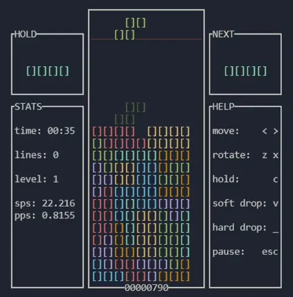
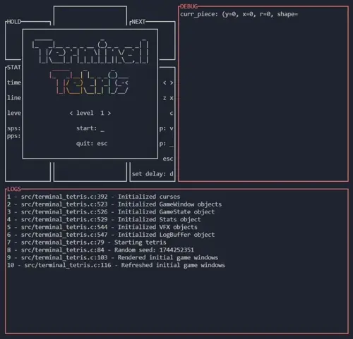
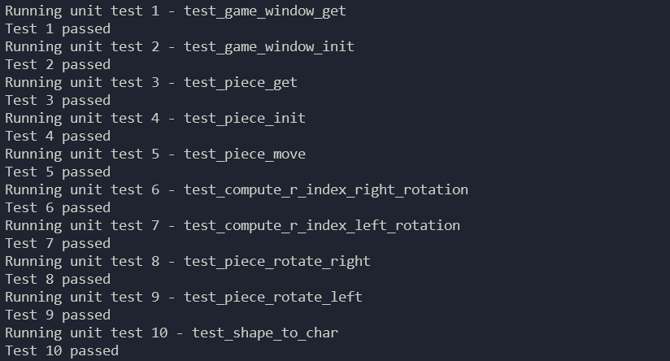
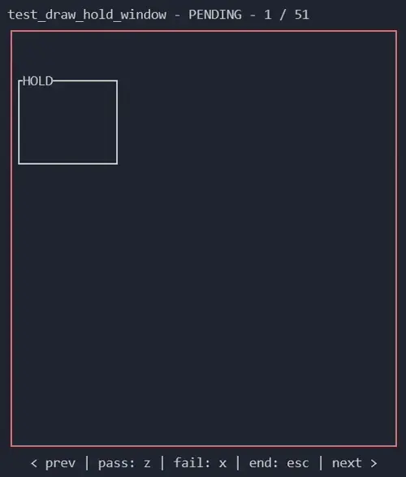
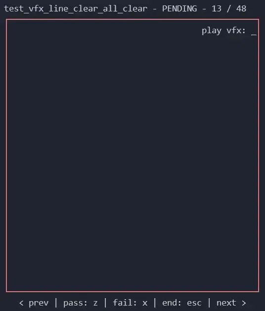
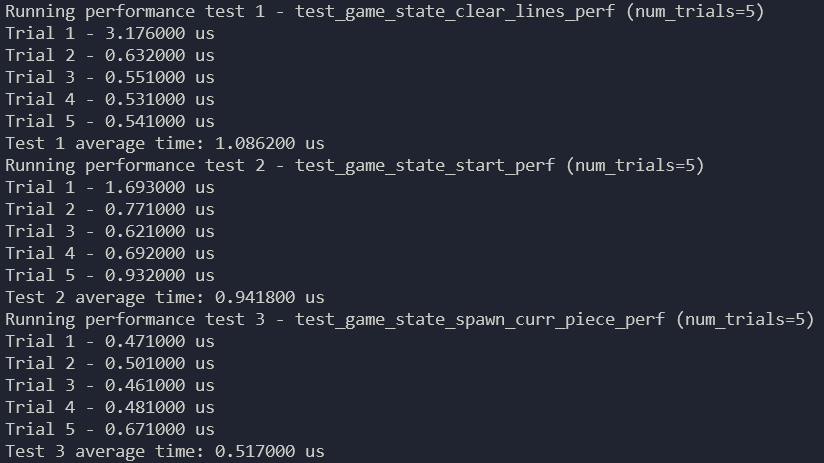

## Terminal Tetris

A small Linux terminal application that plays Tetris, and was implemented according to the [Tetris 
Guideline](https://tetris.wiki/Tetris_Guideline). 

Instructions to run:
- Build the executable: `make`
- Run the game: `./terminal_tetris`

Library used:
- **ncurses**
    - Library for creating textual user interfaces within terminals.
    - Installation on Linux: `apt-get install libncurses-dev`

### Game Specifications
- The game runs at 60 frames per second.
- Rotation is done using the [Super Rotation System](https://tetris.wiki/Super_Rotation_System).
- [Lock delay](https://tetris.wiki/Lock_delay) is on a 0.5s (30 frames) timer and can be reset up to 15 
times on successful moves or rotations (move reset).
- Random generation of the next pieces is done through the [7-bag system](https://tetris.wiki/Random_Generator).
- A level up occurs upon clearing the amount of lines equal to the current level times 10. 
- On the main menu levels 1 through 15 can be selected to start on.
- Gravity is implemented according to the guideline gravity curve, where G represents the number of 
rows dropped per second. These values come from the following formula to determine the time spent 
per row, in seconds: $$\text{Time} = (0.8-((\text{Level}-1)\times0.007))^{(\text{Level} - 1)}$$ 
The time spent per row is then rearranged to get the G values:

| Level | Speed (unit: G) |
| ----- | --------------- |
| 1     | 0.016667        |
| 2     | 0.021017        |
| 4     | 0.026977        |
| 5     | 0.035256        |
| 6     | 0.046922        |
| 7     | 0.063612        |
| 8     | 0.087869        |
| 9     | 0.123700        |
| 10    | 0.177527        |
| 11    | 0.259801        |
| 11    | 0.387811        |
| 12    | 0.590646        |
| 13    | 0.918105        |
| 14    | 1.456960        |
| 15    | 2.361181        |

- [Soft drop](https://tetris.wiki/Drop#Soft_drop) speed is set to 20 times the current level's fall 
speed.
- A game over can occur on [block out](https://tetris.wiki/Top_out#Loss_condition): a piece is spawned overlapping at least one block in the playfield.
- Scoring is done according to 
[recent guideline games](https://tetris.wiki/Scoring#Recent_guideline_compatible_games), where 
combos, back-to-back difficult line clears, and all/perfect clears are present.
- T-spin detection is done using the [3-corner T rule](https://tetris.wiki/T-Spin#Current_rules).
- There is lack of accurate Delayed Auto Shift ([DAS](https://tetris.wiki/DAS)) due to the limitations of terminals. 
- The values "pieces per second" (`pps`) and "score per second" (`sps`) are displayed in the `STATS` 
window.

### Testing:

#### Debug Mode

Launching in debug mode will add both a `LOGS` window and a `DEBUG` window. The `DEBUG` window will 
display the values of several game state variables. The `LOGS` window will display the most recent 
game events that have been logged. Additionally, these logs will be saved to a text file in 
`/logs/debug.txt`. Pressing the `d` key during debug mode will toggle frame-by-frame mode, then 
advancing a frame can be done by pressing any key.

Instructions to run:
- Add the debug `-d` command line argument: `./terminal_tetris -d`

#### Unit Tests

The functions of each source file are individually tested, and the test results are output to the 
terminal.

Instructions to run:
- Build the test runner executable: `make unit_test`
- Run the test runner: `./unit_test_runner`

#### UI Tests

Every UI element can be manually reviewed and either passed or failed. Upon exit, the test results 
are shown.

Instructions to run:
- Build the test runner executable: `make ui_test`
- Run the test runner: `./ui_test_runner`

#### VFX Tests

Every VFX element can be manually reviewed and either passed or failed. Upon exit, the test results 
are shown.

Instructions to run:
- Build the test runner executable: `make vfx_test`
- Run the test runner: `./vfx_test_runner`

#### Performance Tests

Runs tests a specified amount of times, and outputs the runtime of each trial and the overall 
average runtime of each test.

Instructions to run:
- Build the test runner executable: `make perf_test`
- Run the test runner: `./perf_test_runner`
